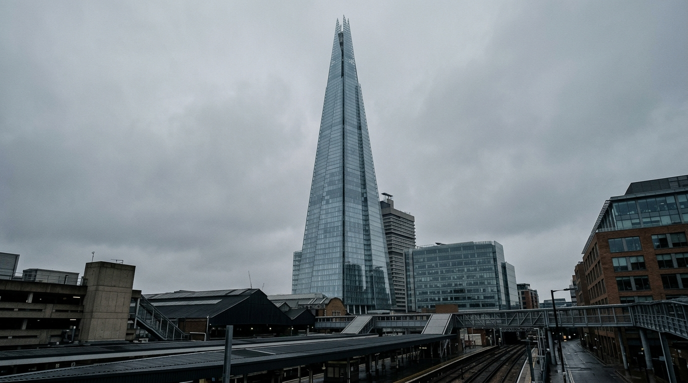

**Scene (planned):** The Shard against a cold overcast sky, shot from a cool drone
height or steep low angle, its glass catching a flat grey sky. No people — pure
class signifier of City finance. Muted cool-neutral palette, no warmth, no lens
flare.

**Prompt (exact, sent to Flow):**
> Hyper-realistic documentary photograph, shot on 35mm film with fine natural grain, muted cool-neutral palette, naturalistic motivated lighting, no lens flares, calm observational tone, landscape orientation. The Shard tower in the City of London seen from a cool low angle against a flat grey overcast sky, its glass catching the cold light. No people — a pure monument to finance. Muted cool-neutral palette, no warmth, no lens flare.

**Narration:** "The City. Another day at the office. Only winners are allowed to work in this building."

**Revisions:**
- v1 (2026-06-27) — planned
- v2 (2026-06-27) — generated (Nano Banana 2, 16:9) via the patched
  `flow_generate_image` path. First panel through the fixed tool.
