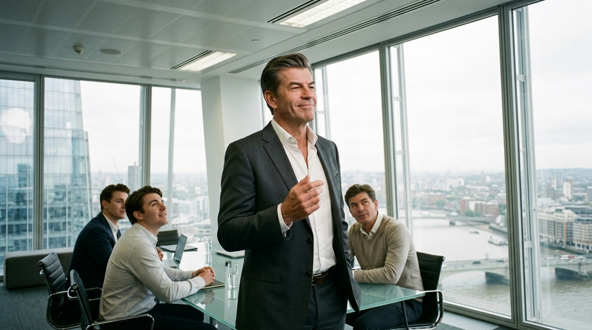

**Scene (planned):** Open-plan meeting floor high in the Shard. Tarquin mid-gesture
closing a deal, chin up, smug; colleagues around a glass table, attentive and
envious. Motivated light only — flat ceiling fluorescents plus cold daylight off
the floor-to-ceiling glass. Observational framing, Tarquin slightly off-centre,
not posed.

**Casting:** Tarquin attached as a **Flow character reference** (`@` → asset
picker → "Tarquin — Character" → Add to Prompt). This is what binds his real
sheet face — see the v3 note.

**Prompt (exact, sent to Flow — with the Tarquin reference attached):**
> Hyper-realistic documentary photograph shot on 35mm film with fine natural grain, muted cool-neutral palette, no lens flares, calm observational tone, landscape orientation. High inside the Shard on an open-plan City meeting floor: this man, a middle-aged City financier in a charcoal suit with an open-collar shirt and no tie, slicked-back greying hair, stands mid-gesture having just closed a deal — chin up, smug and self-satisfied. Two or three younger colleagues sit around a glass table watching him, attentive and faintly envious. Motivated light only: flat overhead office fluorescents and cold grey daylight from the floor-to-ceiling glass behind. Observational framing, off-centre.

**Narration:** "And the winner is — Tarquin. Another deal closed, the spreadsheet locked. Clearly he is better at his job than everyone else in the room."

**Speech:**
- Tarquin: "Let's circle back to synergise our bandwidth…"

**Revisions:**
- v1 (2026-06-27) — planned
- v2 (2026-06-27) — generated casting `@Tarquin` as **plain text** → a generic
  financier, NOT Tarquin's face. (Plain `@name` text does not bind the character.)
- v3 (2026-06-30) — regenerated with Tarquin **attached as a character reference**
  via the `@` asset picker → his real sheet face. Locked. (media `a0232b88…`)
