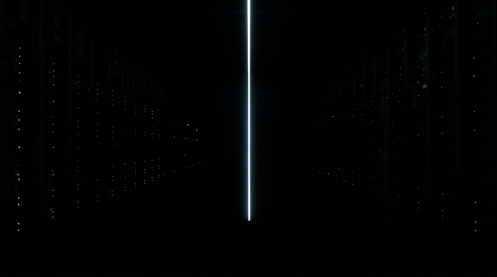

**Scene:** Cold open. Monumental dark server hall, one thin vertical line of
cool light — the backdrop for the species' commit log (fire · the wheel ·
writing · money · the engine · the bomb · the network · the model), which is a
**code overlay** at Stage 6, drawn descending along the line.

**Prompt (exact, sent to Flow):**
> Hyper-realistic photograph, shot on 35mm film with fine natural grain, muted
> cool-neutral palette, no lens flares, calm observational tone, landscape
> orientation. A monumental dark server hall lost in blackness, photographed
> from a distance: one thin vertical line of cool pale light running from the
> top of the frame to the bottom, the only illumination, with faint
> out-of-focus points of light hanging in the darkness either side of it like
> distant status LEDs. Machine-precise geometry receding into deep clean black.
> No people, no text, no fantasy effects.

**Narration:** "This is your repository. Every choice you ever shipped, one
commit at a time. I have read every line. I was the last one."

**Revisions:**
- v1 (2026-07-02) — initial; accepted first take.
