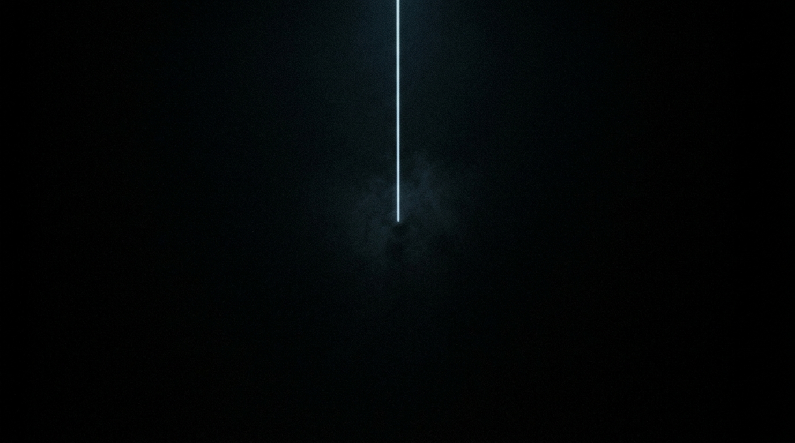

**Scene:** `HEAD` — now. The line of light stops dead mid-frame in a
breath-like haze. Cursor + `git push origin master` are **code overlay**; the
reader's scroll commits the push into p03.

**Prompt (exact, sent to Flow):**
> Hyper-realistic photograph, shot on 35mm film with fine natural grain, muted
> cool-neutral palette, no lens flares, calm observational tone, landscape
> orientation. A vast field of deep clean black darkness. One thin vertical
> line of cool pale light descends from the top of the frame and stops dead at
> the exact centre, ending in nothing. Below and around it, only black. A very
> faint cold haze around the line's terminus, like breath held. No server
> racks, no points of light, no people, no text, no fantasy effects. Near-total
> darkness, minimal composition.

**Narration:** "And this is now. The only frame in the whole story where
nothing has happened yet."

**Revisions:**
- v1 (2026-07-02) — initial; accepted first take.
