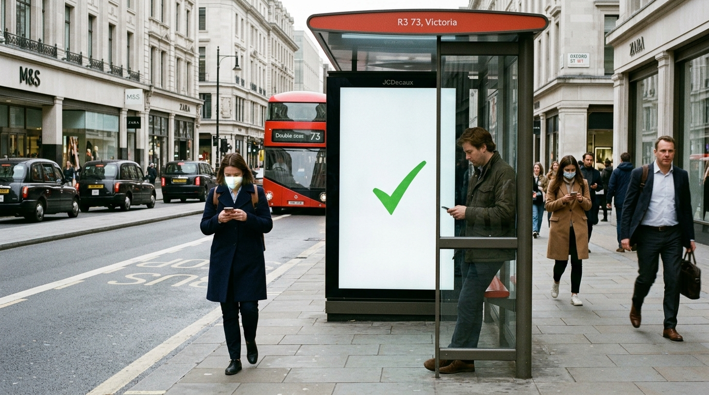

**Scene:** The push lands as relief — Oxford Street on a bright frictionless
morning, everyone in their phones, the green checkmark owning the bus-stop
screen. Branch-diagram margin motif begins peeling (code overlay).

**Prompt (exact, sent to Flow):**
> Hyper-realistic documentary photograph, shot on 35mm film with fine natural
> grain, muted cool-neutral palette, naturalistic motivated lighting, no lens
> flares, calm observational tone, landscape orientation. A clean prosperous
> London street on a bright morning, commuters mid-stride and relaxed, faces
> lit by their phones, no queues anywhere, everything orderly and frictionless.
> At a bus stop, a digital advertising screen shows a single large green
> checkmark on a plain white background — the only graphic element. Camera at
> street level, off-centre, observational, as if a documentary crew caught an
> ordinary perfect Tuesday. Real skin textures, ordinary work clothes, no text
> other than incidental street signage.

**Narration:** "It worked. That was always the problem."

**Revisions:**
- v1 (2026-07-02) — initial; accepted first take (recognisable London, checkmark clean).
