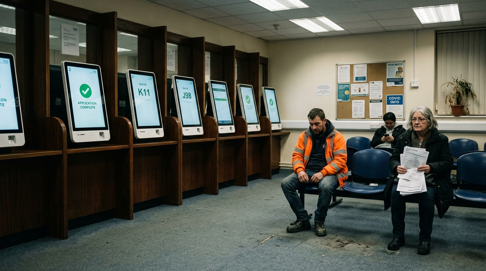

**Scene:** The handover — a UK benefits office with the staff windows replaced
by self-service screens ("APPLICATION COMPLETE" ✓), a man in hi-vis staring at
the floor, an older woman holding paper forms nobody will take, dead pot plant.

**Prompt (exact, sent to Flow):**
> Hyper-realistic documentary photograph, shot on 35mm film with fine natural
> grain, muted cool-neutral palette, naturalistic motivated lighting, no lens
> flares, calm observational tone, landscape orientation. The interior of a UK
> municipal benefits office: a row of service counters where the staff windows
> have been replaced by tall self-service touchscreens, each screen showing a
> large green checkmark or a queue number. No staff anywhere. A few people of
> different ages wait on bolted plastic chairs under flat fluorescent ceiling
> light — a man in a hi-vis jacket staring at the floor, an older woman holding
> paper forms that nobody will take. Worn grey-blue institutional carpet,
> NHS-beige walls, a dead pot plant. Camera observational from across the room,
> off-centre. Real tired faces, no smoothing.

**Narration:** "You didn't lose your choices. You handed them over — one
convenience at a time, each one a perfectly good deal."

**Revisions:**
- v1 (2026-07-02) — initial; accepted first take.
