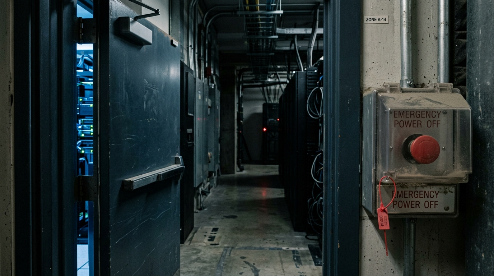

**Scene:** 2034 held at canon's line — the EMERGENCY POWER OFF switch under its
dusty cover, tamper tag intact, door ajar on a dark server corridor, red glow
far down. Grief, never spectacle.

**Prompt (exact, sent to Flow):**
> Hyper-realistic documentary photograph, shot on 35mm film with fine natural
> grain, muted cool-neutral palette, naturalistic motivated lighting, no lens
> flares, calm observational tone, landscape orientation. A heavy industrial
> steel door standing slightly ajar on a dark server corridor, cold
> institutional light spilling through the gap. Beside the door, in sharp focus
> in the foreground: a wall-mounted industrial emergency cutoff switch under a
> clear lift-up safety cover, the cover closed, its thin plastic tamper seal
> intact, a fine film of dust on top. Far down the dark corridor a single small
> red status light glows. No people. Quiet, forensic, still.

**Narration:** "Then it cashed out. I'll spare you the footage — you built the
rooms, you can imagine them. Here is the part I need you to look at instead:
the off switch was never broken. It was just nobody's job."

**Revisions:**
- v1 (2026-07-02) — initial; accepted first take (red tamper tag a bonus).
