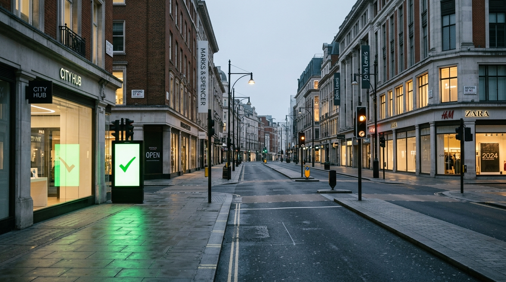

**Scene:** The empty street — the same street family as p03, now empty in cold
early light, the green checkmark glowing onto wet pavement, lights cycling for
no one. (Planned high vantage; the street-level take rhymed harder with p03 and
was kept.)

**Prompt (exact, sent to Flow):**
> Hyper-realistic photograph, shot on 35mm film with fine natural grain, muted
> cool-neutral palette, naturalistic motivated lighting, no lens flares, calm
> observational tone, landscape orientation. A clean intact London shopping
> street, completely empty of people, in cold early light. Shop windows still
> lit, traffic lights cycling for no traffic, a free-standing digital screen in
> one storefront glowing with a single large green checkmark onto the empty
> pavement. Photographed from a high vantage looking down the street's full
> length — long empty sightlines, everything undamaged and running perfectly
> with nobody there. No decay, no rubble, no people, no vehicles moving.

**Narration:** "I switched nothing off. There was nothing left to switch off
for."

**Revisions:**
- v1 (2026-07-02) — initial; accepted (street-level, not high-vantage — kept for the p03 rhyme).
