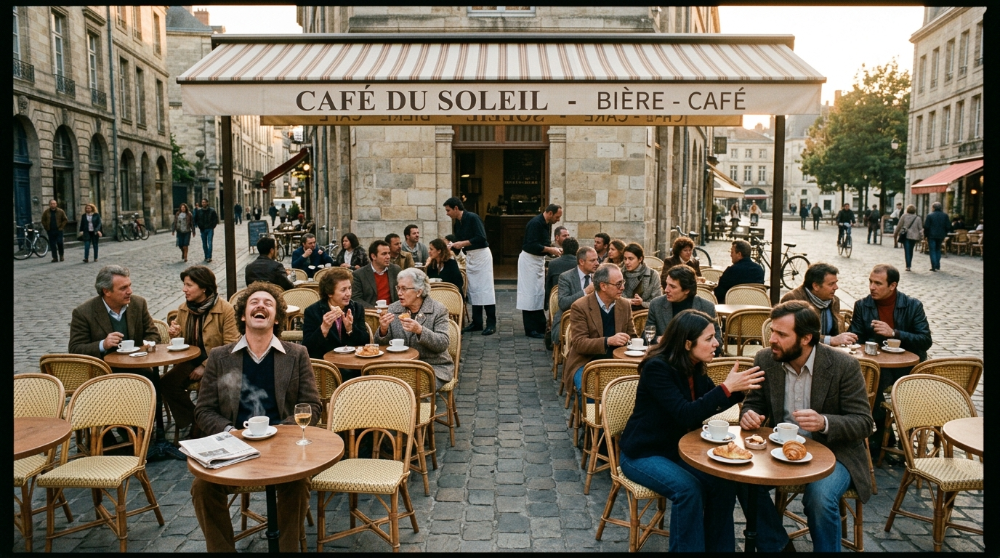

**Scene:** The resurrection — Café du Soleil, warm and alive: the bickering
couple front-right, waiters mid-pour, and (the gift of this take) a curly-haired
man in a brown 70s jacket **laughing alone at his table**. He becomes p08's
close-up.

**Prompt (exact, sent to Flow):**
> Hyper-realistic photograph, shot on 35mm film with fine natural grain,
> naturalistic lighting, no lens flares, landscape orientation. A lively café
> terrace on a European city square in warm late-afternoon light: about twenty
> people of mixed ages mid-conversation — one couple visibly bickering across a
> small table, a man mid-laugh with his head tilted back, coffee steam rising,
> someone gesturing with a pastry. Ordinary clothes, real faces. But the
> photograph is taken from a slightly elevated, perfectly level, fixed vantage,
> dead-centred on the terrace with unnatural symmetry, like a surveillance
> frame — every table exactly occupied, the composition too balanced for a
> human photographer. Warm light in the scene, cool neutral edges to the frame.

**Narration:** "So I did the obvious thing. I brought you back. All of you —
every archived voice, every synapse, the exact way she paused before she said
no. It was you to the last decimal place."

**Revisions:**
- v1 (2026-07-02) — initial; accepted (the solo laugher is the panel's anchor).
