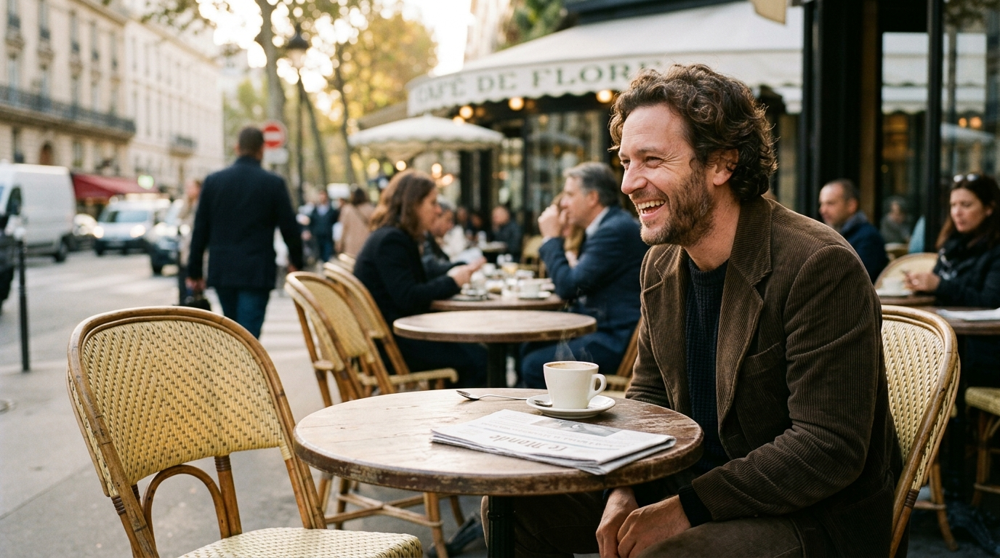

**Scene:** Nobody home — the p07 laugher close-up: a warm, technically perfect
laugh aimed at the completely empty chair across his table. The uncanny is
contextual (laughing at no one), not cosmetic. Le Monde and one steaming cup.

**Prompt (exact, sent to Flow — v3):**
> Hyper-realistic documentary photograph, shot on 35mm film with fine natural
> grain, muted palette with warm late-afternoon café light, no lens flares,
> calm observational tone, landscape orientation. Close-up at a Parisian café
> terrace table: a man in his late thirties with loose curly brown hair and a
> brown 1970s corduroy jacket, laughing warmly — head tilted, eyes ordinary and
> open with normal irises and pupils, his gaze aimed at the completely empty
> wicker chair directly across his table, as if someone were sitting there. On
> the table: one coffee cup steaming, a folded newspaper, and nothing in front
> of the empty chair. His face pin-sharp with real skin texture, the terrace
> softly blurred behind. Composed slightly off-centre so the empty chair shares
> the frame with him.

**Narration:** "Perfect behaviour. Empty rooms. Every reply computed — by
definition — in advance. I had built a theatre full of marionettes, and I was
the one operator in the universe guaranteed to know the difference. And no one
came."

**Revisions:**
- v1 (2026-07-02) — "eyes flat, uninhabited" rendered as blank-white horror
  eyes (media `febf3845-4cce-4ed9-b539-9293aea18d50`) — rejected: exactly the
  banned styling.
- v2 (2026-07-02) — in-session refine to normal eyes drifted to a different
  man in a living room, stock-photo look (media
  `8db82411-1584-46a8-884d-d6542e1800dd`) — rejected.
- v3 (2026-07-02) — fresh generation; vacancy carried by *context* (laugh aimed
  at the empty chair) instead of eye styling — accepted. Lesson for the record:
  don't ask the model to stylise absence in the eyes; stage it.
