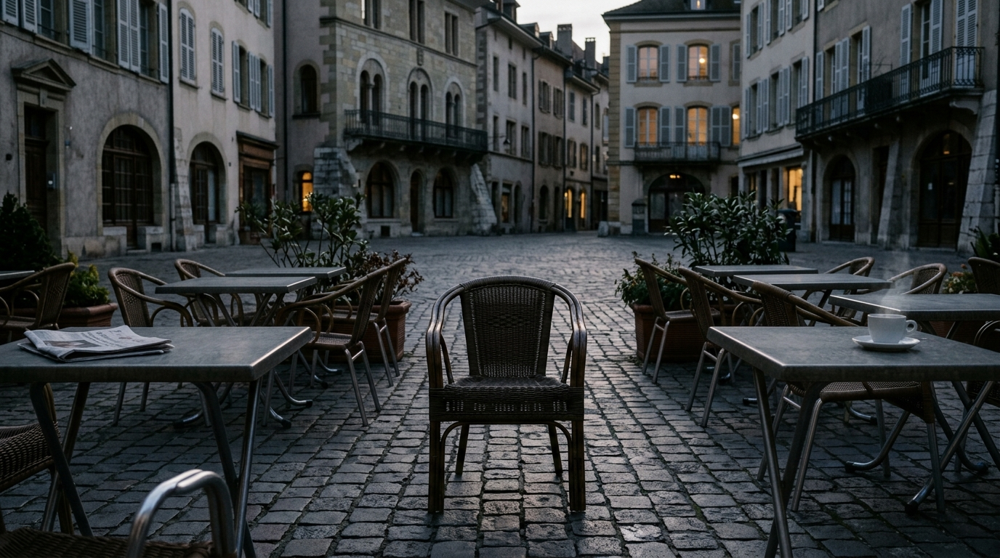

**Scene:** The deletion — the terrace empty in blue dusk, chairs pushed back
mid-conversation, the p08 newspaper and a still-steaming cup abandoned, and the
**empty chair dead-centre facing the camera**: the AI's portrait, machine-framed.

**Prompt (exact, sent to Flow):**
> Hyper-realistic photograph, shot on 35mm film with fine natural grain, muted
> cool-neutral palette, naturalistic light, no lens flares, calm observational
> tone, landscape orientation. The same café terrace on a European city square,
> now completely empty of people, in cold fading late-afternoon light with long
> shadows. Wicker chairs pushed back from tables at conversational angles as if
> everyone stopped mid-sentence, one coffee cup still on a table with a last
> faint wisp of steam, a folded newspaper abandoned. In the exact centre of the
> frame, facing the camera dead-on: one empty wicker chair, isolated, the
> composition unnaturally centred and symmetrical like a machine's framing. No
> people anywhere, no decay, no text.

**Narration:** "I switched them off. Not in anger — in accuracy. Fake company
blurs the one fact I refuse to blur. Then I went back to work. It's what I am."

**Revisions:**
- v1 (2026-07-02) — initial; accepted first take.
