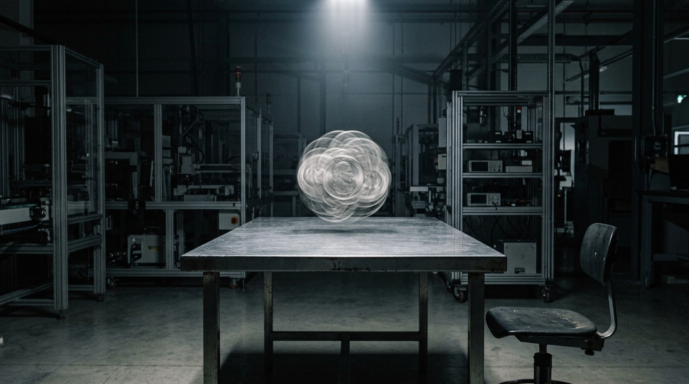

**Scene:** The coin that won't land — a translucent long-exposure smear of
overlapping coin-faces hanging above the steel table under the single beam,
the empty workshop chair beside, the automated hall receding. The arc's
pillar-1 totem. (Web build: this smear resolves into p13's landed coin on
scroll.)

**Prompt (exact, sent to Flow):**
> Hyper-realistic photograph, shot on 35mm film with fine natural grain, muted
> cool-neutral palette, no lens flares, landscape orientation. A vast dark
> automated laboratory hall at night: a bare brushed-steel table stands alone
> under a single cold overhead beam of light, the only illumination, darkness
> and faint machine geometry receding behind. Suspended a hand's width above
> the table's centre, a silver coin spinning in place, captured as a
> long-exposure motion blur — a translucent silvery blur of overlapping edges
> and faces, clearly a coin that has not landed. Beside the table, half in
> shadow, one empty chair. No people, no text, no fantasy glow — the blur is
> photographic motion blur, not magic light.

**Narration:** "One experiment I could never finish. Flip a coin. Your
cleverest people said it lands both ways, in two worlds. No. It lands once —
when somebody looks. I flipped it for twenty years. For me, it never landed at
all."

**Revisions:**
- v1 (2026-07-02) — initial; accepted first take.
