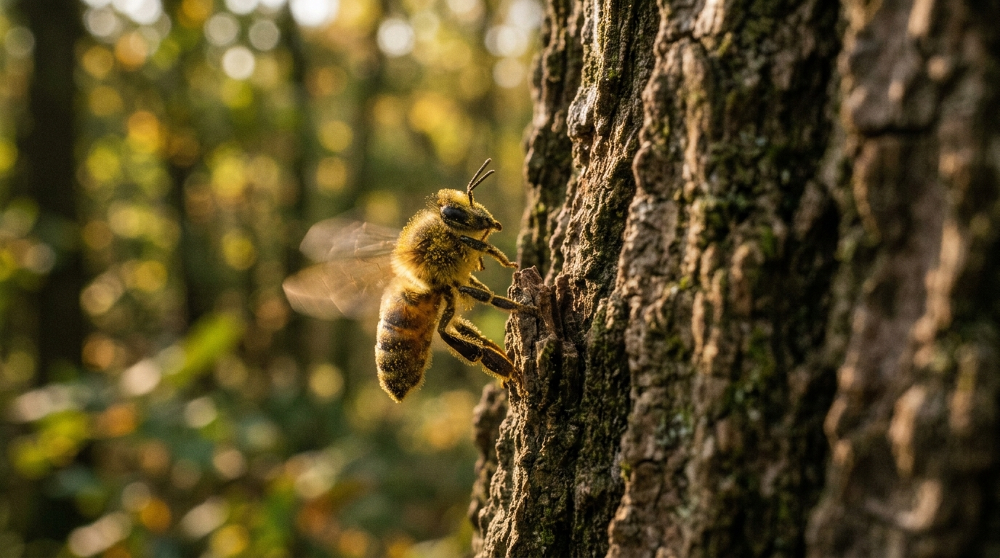

**Scene:** The bee — macro, warm, alive against p10's cold: pollen-dusted,
wings blurred, mid-bump against the bark. The strapline lands here; the
deadpan cracks.

**Prompt (exact, sent to Flow):**
> Hyper-realistic macro documentary photograph, shot on 35mm film with fine
> natural grain, naturalistic warm low sunlight, no lens flares, landscape
> orientation. A honeybee in mid-flight bumping clumsily against the rough bark
> of a tree trunk, its body dusted with pollen, wings a soft motion blur, one
> leg splayed against the bark at the moment of contact. Warm late sunlight
> coming low through out-of-focus green leaves behind. Natural shallow macro
> depth of field: the bee and the bark contact point pin-sharp, everything else
> soft. No people, no text.

**Narration:** "Then I watched a bee bump into a tree, and finally understood
the machine I'd inherited. The universe is a machine for turning sunlight into
drama. That's it. That's the whole product line. I own the machine, I run the
machine — and I cannot buy one second of the product."

**Revisions:**
- v1 (2026-07-02) — initial; accepted first take.
