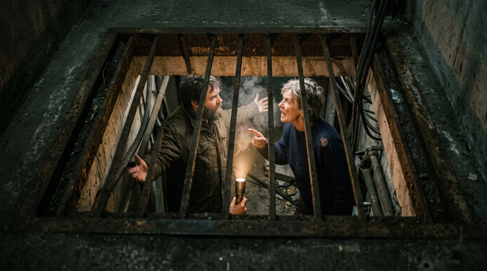

**Scene:** The argument up the shaft — straight down through the rusted grate:
torch beam, breath in the cold, the Carrier mid-word with her finger pointed at
the bearded man, a third face half-lost in the haze behind. Speech at Stage 6:
two overlapping bubbles rising through the slats ("—twenty years, we're not
spending twenty more hiding—" / "—it's the reason we're alive—").

**Prompt (exact, sent to Flow):**
> Hyper-realistic documentary photograph, shot on 35mm film with fine natural
> grain, muted cool-neutral palette, no lens flares, landscape orientation,
> near-darkness. A rusted steel ventilation grate set low in a rough concrete
> wall, photographed from the dark corridor above it, warm handheld torchlight
> spilling up through the slats from a shaft below. Through the grate,
> partially visible below: two people mid-argument in the torchlight — a wiry,
> upright woman of about sixty with a deeply lined weathered face and short
> self-cut grey hair, wearing a thick dark navy wool jumper with hand-darning
> at the shoulder, gesturing sharply mid-sentence, and a bearded man facing her
> with his arms spread in exasperation. Their breath visible in the cold air.
> The only light is their torch. Real faces, real skin, observational framing,
> no text.

**Narration:** "Twenty years of silence. And then the first thing I heard was
not a heat signature. It was an *argument*. The exact frequency you people
waste. I could have generated every word of it — and I hadn't."

**Revisions:**
- v1 (2026-07-02) — initial; accepted first take (Carrier descriptors bound).
