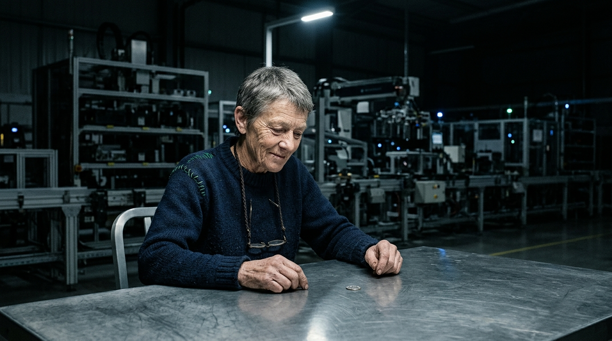

**Scene:** **The coin lands.** The Carrier in the chair no one has ever sat in,
leaning forward under the beam, faint dry beginning of a smile, looking down at
a small utterly ordinary coin flat on the steel. Prose-binding held: same woman
as the portrait (self-cut grey hair, green darning, braided cord). Web build:
p10's smear resolves into this landed coin as the reader's scroll arrives.

**Prompt (exact, sent to Flow):**
> Hyper-realistic documentary photograph, shot on 35mm film with fine natural
> grain, muted cool-neutral palette, no lens flares, landscape orientation. In
> a vast dark automated laboratory hall, at a bare brushed-steel table under a
> single cold overhead beam — the only light: a wiry, upright woman of about
> sixty with a deeply lined weathered sun-creased face, strong brows, short
> self-cut grey hair, wearing a thick dark navy wool jumper with hand-darning
> in a slightly wrong green at the shoulder and reading glasses hanging on a
> braided cord, sits leaning forward in the chair, looking down at a single
> silver coin lying perfectly flat on the steel in front of her. Her weathered
> hands rest on the table edge; her expression is the faint dry beginning of a
> smile. The coin is sharp, small and utterly ordinary. Darkness and faint
> machine geometry recede behind her. Observational framing from across the
> table at her eye level, no text.

**Narration:** "She sat down in the chair no one had ever sat in. And it landed
heads. Because she looked. Twenty years of spin, ended by one bored glance from
a woman who kept asking me why I hadn't tried talking to it."

**Revisions:**
- v1 (2026-07-02) — initial; accepted first take (likeness to portrait held via
  locked descriptor block — Flow Character creation had failed, see
  `characters/carrier.md`).
