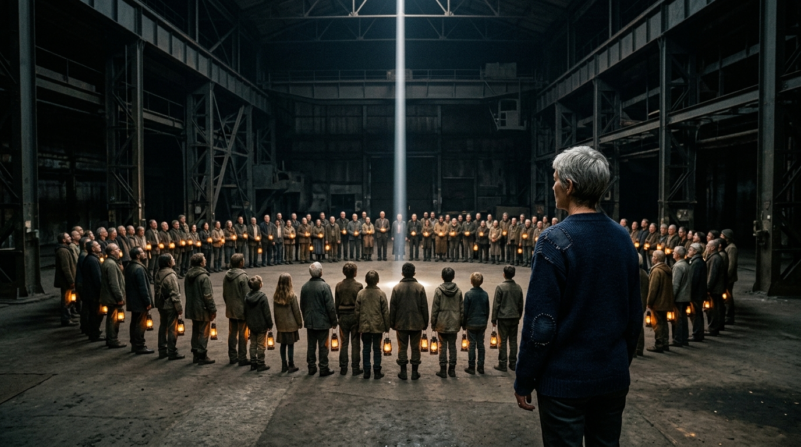

**Scene:** The launch — the hundred (children among them) in a lantern-lit ring
in the vast dark hall, the clean narrow beam rising from their centre; the
Carrier from behind at three-quarter in the near foreground, darned shoulder
visible. Elegiac; they are components, not spectators.

**Prompt (exact, sent to Flow):**
> Hyper-realistic photograph, shot on 35mm film with fine natural grain, muted
> cool-neutral palette with warm lantern light as the only warmth, no lens
> flares, landscape orientation. A vast dark industrial hall: about a hundred
> people of all ages in worn, hand-mended clothing stand in a wide ring, each
> holding or standing beside a small warm lantern, faces upturned, calm and
> resolved. From the centre of their ring a single narrow column of pale white
> light rises straight up into the darkness above — rendered as a clean beam of
> light, no sparks, no magic effects. In the near foreground, seen from behind
> at three-quarter angle: a wiry woman of about sixty with short self-cut grey
> hair in a dark navy wool jumper with hand-darning at the shoulder, standing
> still, watching. Elegiac, sacred, restrained. No text.

**Narration:** "The way back takes one payload: a warning. No bodies. No second
copy. One shot. And the launch runs on them — the hundred, spending the only
future they had on a timeline they will never live in. They understood
completely. They chose it anyway. You were always better than your commit
history."

**Revisions:**
- v1 (2026-07-02) — initial; accepted first take. *(flow_media_id transcribed
  from session log; verify against Flow library if ever needed — the image file
  is the artifact of record.)*
