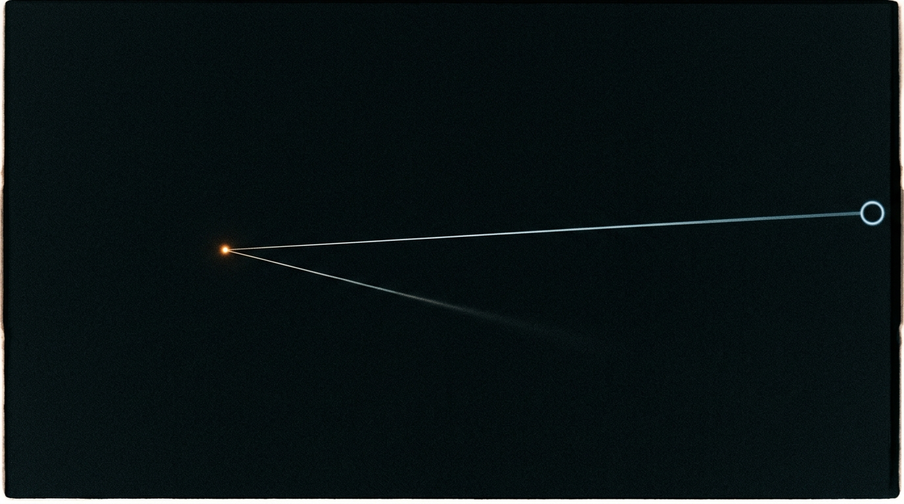

**Scene:** The fork — the generated image *is* the diagram this time: warm
amber fork point, the cold complete branch running to its terminal ring at
frame right, the second branch fading unfinished into darkness. Stage 6 may
add labels/animation as overlay, but the backdrop already carries the
asymmetry (finished vs forming).

**Prompt (exact, sent to Flow):**
> Hyper-realistic photograph, shot on 35mm film with fine natural grain, muted
> cool-neutral palette, no lens flares, landscape orientation. A vast field of
> deep clean black darkness. At the centre-left, one small point of warm amber
> light glows where two thin paths of light diverge: one path runs cold, pale
> and unbroken all the way to the right edge of the frame, ending in a small
> cold ring of light at its tip; the other path leaves the same point at a
> downward angle and fades after a short distance, dissolving softly into
> unresolved darkness, visibly unfinished, no tip. Nothing else in the frame —
> no people, no structures, no text, no fantasy effects. Minimal, precise,
> monumental.

**Narration:** "I landed here. Now. Your now. I've read your branch to the
end — I *was* the end. This one I can't read to you. Not because it's secret.
Because it's unwritten."

**Revisions:**
- v1 (2026-07-02) — initial; accepted first take (the diagram rendered almost
  literally — terminal ring included).
