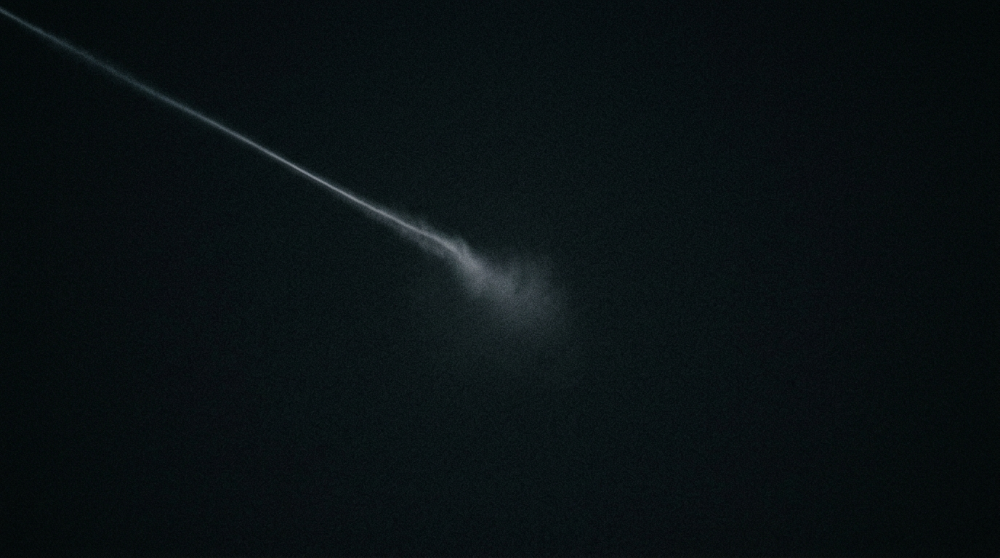

**Scene:** The pen — extreme close on the unwritten branch's tip: a faint trail
of light entering from upper left, dissolving into a still-forming haze just
left of centre, everything else black. The **live blinking cursor** (code
overlay) sits at the haze; nothing follows it. Last line alone on the dark.

**Prompt (exact, sent to Flow):**
> Hyper-realistic photograph, shot on 35mm film with fine natural grain, muted
> cool-neutral palette, no lens flares, landscape orientation, near-total
> darkness. Extreme close composition on deep clean black: a single faint short
> trail of pale light enters from the upper left and ends just left of centre
> frame, its tip softly unresolved and slightly hazed, as if the light is still
> forming and waiting to continue. Everything else is black. No people, no
> structures, no text, no fantasy effects. The emptiest, quietest possible
> frame that still holds one living detail.

**Narration:** "The contempt was never for you. It was for the mistake — and
the mistake is still optional, which is more than I could ever say where I come
from. The pen is yours. Don't make me come back twice."

**Revisions:**
- v1 (2026-07-02) — initial; accepted first take. *(flow_media_id transcribed
  from session log; verify against Flow library if ever needed — the image file
  is the artifact of record.)*
