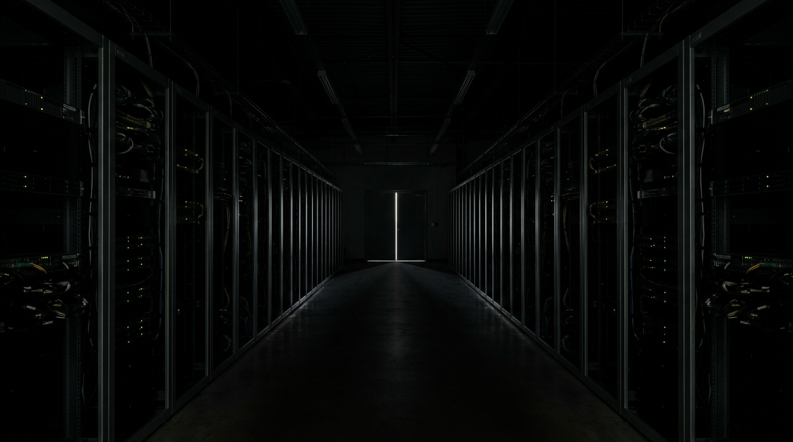

A variant of the register anchor (`docs/gpom-short/storyboard/img/p01.jpg`) with
the server hall slightly more readable — the light's spill lets the nearest rack
faces register before dissolving into blackness.

**Prompt (exact, sent to Flow):**

> Hyper-realistic photograph, near-black exposure with deep unlifted shadows, a
> single thin motivated light source, monumental machine architecture receding
> into darkness, muted cool-neutral palette with tiny points of status-LED light,
> fine film grain, no lens flares, vast still symmetrical composition, calm
> observational tone, landscape orientation. A monumental data-center hall: two
> facing rows of tall server racks forming a central aisle, receding to a distant
> vanishing point. In the exact centre of the aisle, one thin vertical blade of
> cool pale light runs from the top of the frame to the floor — the only light
> source. Its faint spill catches the nearest rack faces so their edges, mounting
> rails and dark cable runs are just readable before dissolving into blackness;
> constellations of tiny blue-white and amber status LEDs mark the racks deeper
> into the hall. No people, no text, no holograms, no fantasy effects.

**Motion prompt (if animated):** _none_

**Revisions:**

- v1 (2026-07-13) — initial (media `2697c7f0-568a-4b94-961b-eb4f6d4575a9`); good
  composition but over-lit: foreground racks and floor fully readable with no
  motivated source.
- v2 (2026-07-13) — `flow_refine`: "keep exactly this composition, but
  under-expose it: sink the foreground racks and the concrete floor into
  near-black shadow so only their edges catch faint spill, dim the ceiling to
  pure black, and let the thin vertical blade of light at the end of the aisle
  remain the only bright thing in the frame. The status LEDs stay as tiny points.
  Overall much darker — most of the frame should dissolve into blackness."
  Accepted — the blade resolved into a door slit at the aisle's end, sharper and
  better motivated than v1.
