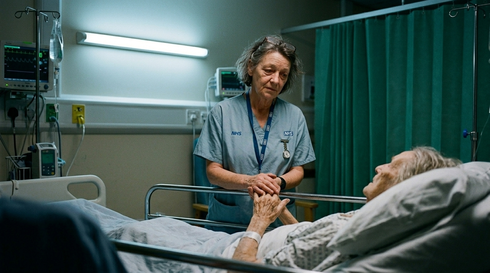

**Beat:** the work

**Prompt (exact, sent to Flow — reconstructed from storyboard.md house style + scene; flow_media_id unknown, predates per-panel records):**
> Hyper-realistic documentary photograph, shot on 35mm film with fine natural
> grain, muted cool-neutral palette, naturalistic motivated lighting, no lens
> flares, calm observational tone, landscape orientation. A weary NHS nurse in
> her late fifties (teal scrubs, lanyard, fob watch) stands at the bedside of
> a frail elderly patient in a dim hospital ward at night, gently holding the
> patient's hand through the bed rail. Cold fluorescent overhead light, green
> privacy curtains, a drip stand and monitors glowing faintly. Her face is
> kind and exhausted. Quiet, intimate, observational.

**Narration:** "This is Dawn. She keeps strangers alive for a living. The system that runs on her is about to teach her some arithmetic."

**Revisions:**
- v1 (2026-06-16) — original generation via the V1 pipeline; record backfilled 2026-07-14.
