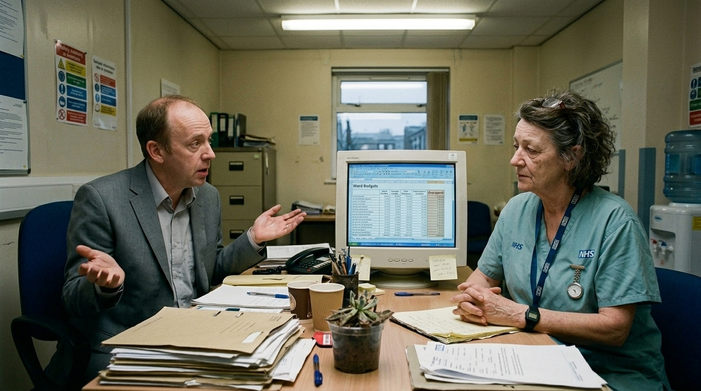

**Beat:** the line

**Prompt (exact, sent to Flow — reconstructed from storyboard.md house style + scene; flow_media_id unknown, predates per-panel records):**
> Hyper-realistic documentary photograph, shot on 35mm film with fine natural
> grain, muted cool-neutral palette, naturalistic motivated lighting, no lens
> flares, calm observational tone, landscape orientation. The same nurse sits
> across a cramped, cluttered hospital office desk from a middle-manager in a
> cheap suit who gives an apologetic shrug. A spreadsheet glows on an old
> monitor between them. Strip lighting, NHS-beige walls, a sad pot plant.
> Dawn's hands folded, composed. The manager mid-sentence, palms up.

**Speech (manager):** "There's no magic money tree, Dawn."
**Narration:** "She asked for a little more — for the ward, for herself. They told her the oldest bedtime story in the country."

**Revisions:**
- v1 (2026-06-16) — original generation via the V1 pipeline; record backfilled 2026-07-14.
