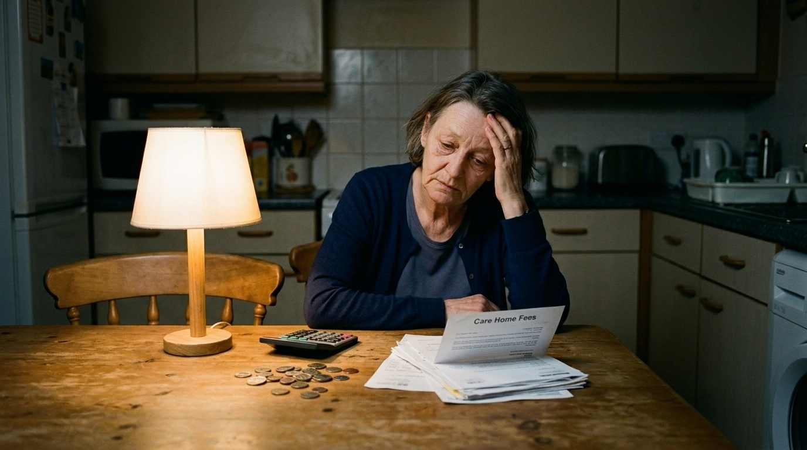

**Beat:** same maths at home

**Prompt (exact, sent to Flow — reconstructed from storyboard.md house style + scene; flow_media_id unknown, predates per-panel records):**
> Hyper-realistic documentary photograph, shot on 35mm film with fine natural
> grain, muted cool-neutral palette, naturalistic motivated lighting, no lens
> flares, calm observational tone, landscape orientation. The same nurse, now
> in a cardigan, sits alone at night at a small worn kitchen table in a modest
> terraced house. A few coins and a calculator in front of her, a stack of
> bills, and an opened letter headed "care home fees". A single warm lamp; the
> rest of the room in shadow. She rests her forehead on one hand, tired, not
> weeping.

**Narration:** "At home, the same maths. No money for the ward. No money for her mum. No money, no money, no money."

**Revisions:**
- v1 (2026-06-16) — original generation via the V1 pipeline; record backfilled 2026-07-14.
