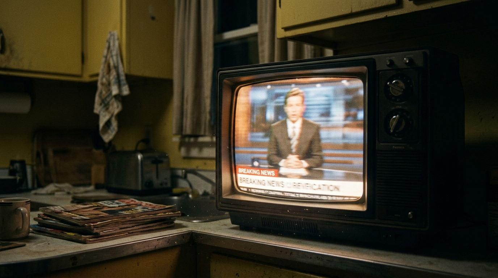

**Beat:** the trick

**Prompt (exact, sent to Flow — reconstructed from storyboard.md house style + scene; flow_media_id unknown, predates per-panel records):**
> Hyper-realistic documentary photograph, shot on 35mm film with fine natural
> grain, muted cool-neutral palette, naturalistic motivated lighting, no lens
> flares, calm observational tone, landscape orientation. Close on an old
> television in the corner of the dim kitchen, flickering to life. The screen
> shows a generic news studio with a red breaking-news chyron bar (text
> illegible/abstract). Warm CRT glow spilling into the dark room, dust in the
> light. Slightly ominous.

**Narration:** "And then the telly did a magic trick."

**Revisions:**
- v1 (2026-06-16) — original generation via the V1 pipeline; record backfilled 2026-07-14.
