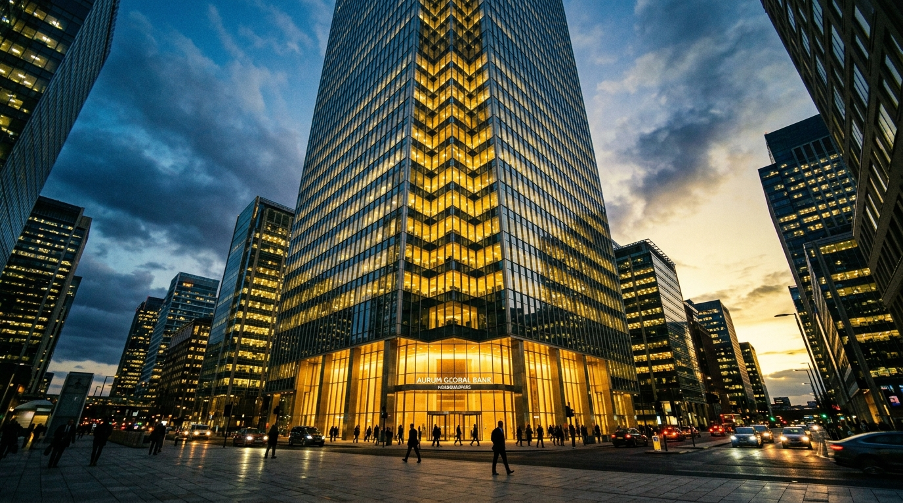

**Beat:** bailout

**Prompt (exact, sent to Flow — reconstructed from storyboard.md house style + scene; flow_media_id unknown, predates per-panel records):**
> Hyper-realistic documentary photograph, shot on 35mm film with fine natural
> grain, muted cool-neutral palette, naturalistic motivated lighting, no lens
> flares, calm observational tone, landscape orientation. A towering glass
> bank skyscraper in a financial district at dusk, lit gold from within,
> reflections gleaming. Suited figures tiny at its base. A sense of vast,
> effortless wealth. A faint news-ticker glow. Opulent, cold, immense —
> contrast to the cramped earlier panels.

**Narration:** "2008. For the people who broke it: found instantly. Five hundred billion, no questions asked."

**Revisions:**
- v1 (2026-06-16) — original generation via the V1 pipeline; record backfilled 2026-07-14.
