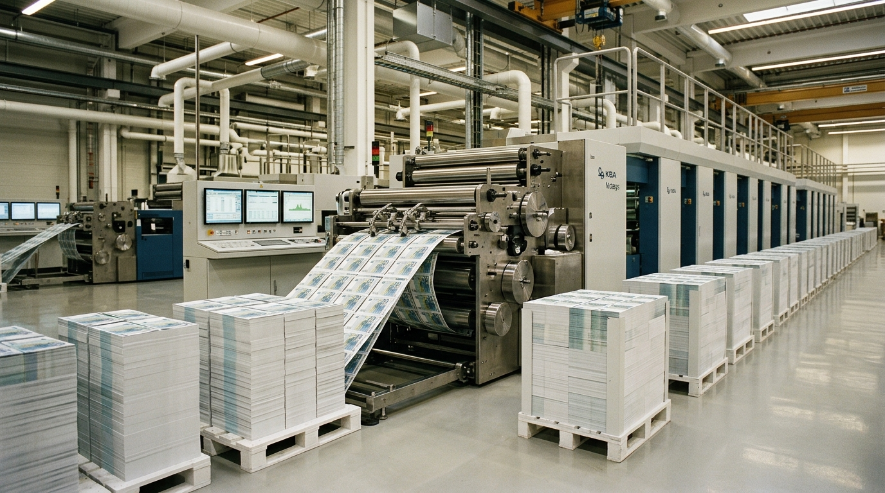

**Beat:** QE

**Prompt (exact, sent to Flow — reconstructed from storyboard.md house style + scene; flow_media_id unknown, predates per-panel records):**
> Hyper-realistic documentary photograph, shot on 35mm film with fine natural
> grain, muted cool-neutral palette, naturalistic motivated lighting, no lens
> flares, calm observational tone, landscape orientation. The interior of a
> central bank / mint: pristine machinery printing crisp sheets of fresh
> banknotes that cascade in immaculate stacks, lit clinically gold and white.
> Endless, frictionless, abundant. No people — just money being willed into
> existence.

**Narration:** "Eight hundred and ninety-five billion. Conjured from nothing. No tree required, apparently."

**Revisions:**
- v1 (2026-06-16) — original generation via the V1 pipeline; record backfilled 2026-07-14.
