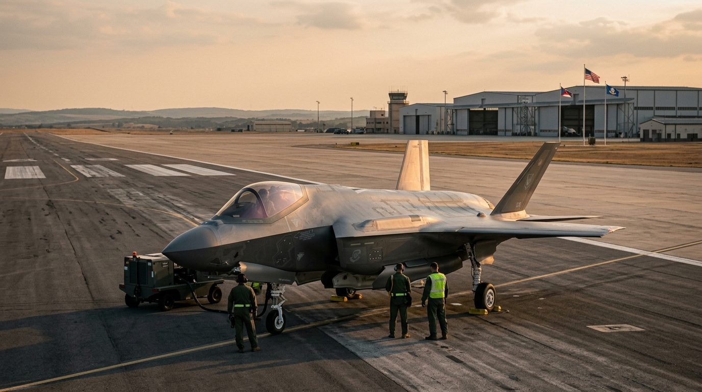

**Beat:** war

**Prompt (exact, sent to Flow — reconstructed from storyboard.md house style + scene; flow_media_id unknown, predates per-panel records):**
> Hyper-realistic documentary photograph, shot on 35mm film with fine natural
> grain, muted cool-neutral palette, naturalistic motivated lighting, no lens
> flares, calm observational tone, landscape orientation. A sleek military
> fighter jet on a runway at golden hour, ground crew small beside it, a
> defence-procurement sense of scale and money. Clean, expensive, applauded.
> Flags faintly in the background. Imposing.

**Narration:** "And for the things that end lives: a blank cheque, and a standing ovation."

**Revisions:**
- v1 (2026-06-16) — original generation via the V1 pipeline; record backfilled 2026-07-14.
