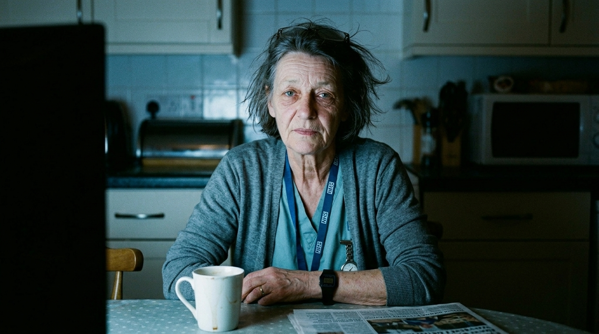

**Beat:** the arithmetic

**Prompt (exact, sent to Flow — reconstructed from storyboard.md house style + scene; flow_media_id unknown, predates per-panel records):**
> Hyper-realistic documentary photograph, shot on 35mm film with fine natural
> grain, muted cool-neutral palette, naturalistic motivated lighting, no lens
> flares, calm observational tone, landscape orientation. The same nurse, back
> in her dark kitchen, face lit only by the cold flicker of the television
> off-frame. She has lifted her head; her tired eyes are sharp now — the
> moment of understanding landing. Still, quiet, but something has changed in
> her expression. Documentary close portrait.

**Narration:** "So Dawn did the arithmetic they hoped she never would."

**Revisions:**
- v1 (2026-06-16) — original generation via the V1 pipeline; record backfilled 2026-07-14.
