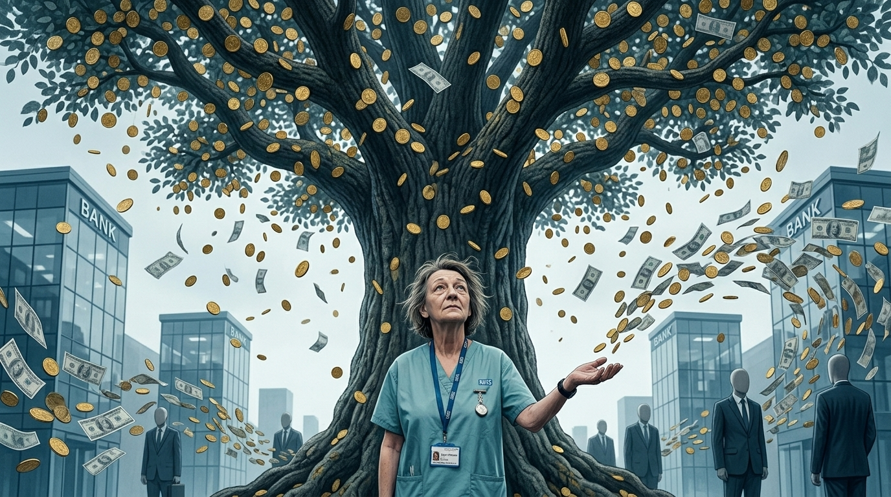

**Beat:** the reveal

**Prompt (exact, sent to Flow — reconstructed from storyboard.md house style + scene; flow_media_id unknown, predates per-panel records):**
> Hyper-realistic documentary photograph, shot on 35mm film with fine natural
> grain, muted cool-neutral palette, naturalistic motivated lighting, no lens
> flares, calm observational tone, landscape orientation. Surreal but
> photographic: the same nurse stands small and empty-handed in the foreground
> beneath an enormous tree heavy with gold coins, the tree violently shaking
> and raining coins and banknotes in a glittering downpour. But every coin
> streams past her toward glass bank towers and suited figures behind her —
> none lands on her open hand. She looks up at the tree. Awe and quiet anger.
> Muted palette except the gold.

**Narration:** "The tree was always real. It just never shook for her."

**Revisions:**
- v1 (2026-06-16) — original generation via the V1 pipeline; record backfilled 2026-07-14.
