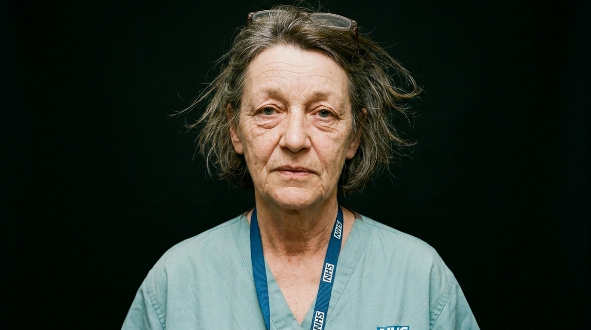

**Beat:** the warning

**Prompt (exact, sent to Flow — reconstructed from storyboard.md house style + scene; flow_media_id unknown, predates per-panel records):**
> Hyper-realistic documentary photograph, shot on 35mm film with fine natural
> grain, muted cool-neutral palette, naturalistic motivated lighting, no lens
> flares, calm observational tone, landscape orientation. The same nurse, in
> scrubs, faces the camera directly in stark, simple light against a
> near-black background — a calm, unflinching portrait, exhausted but
> resolute, looking straight at the viewer. Minimal, confrontational,
> intimate.

**Narration:** "We let three little words — *we can't afford it* — decide who got to live. It was never true. It was never a tree. It was a choice, with a press release. You still have time to notice. Don't make us say we told you so."

**Revisions:**
- v1 (2026-06-16) — original generation via the V1 pipeline; record backfilled 2026-07-14.
